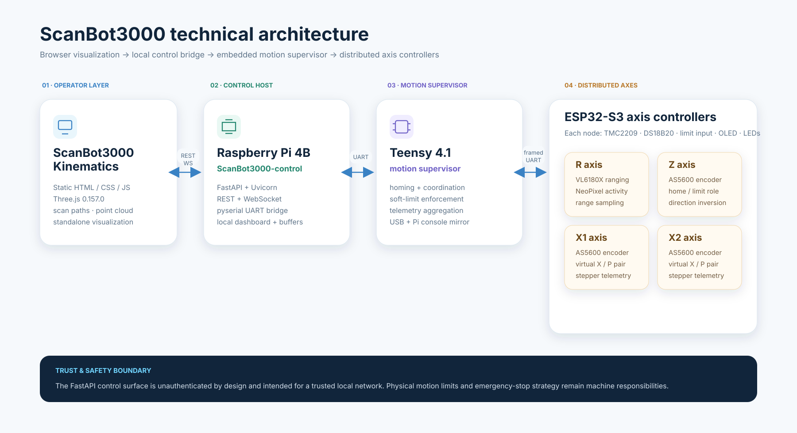

# ScanBot3000

An open motion-control, visualization, and scanning stack built from a browser kinematics client, Raspberry Pi control bridge, and distributed embedded motion firmware.


ScanBot3000 is organized as three focused implementation repositories plus this project-home repository. The split keeps firmware, host control, and browser visualization independently understandable while this repository provides the system-level architecture, setup order, hardware overview, release compatibility manifest, security model, and contributor entry point.

> **Project home:** [Scanbot3000](https://github.com/DreamMakers2/Scanbot3000)

## Project repositories

| Repository | Role | Short description |
| --- | --- | --- |
| [ScanBot3000-firmware](https://github.com/DreamMakers2/ScanBot3000-firmware) | Embedded control | Distributed Teensy 4.1 / ESP32-S3 firmware for homing, coordinated motion, telemetry, TMC2209 control, and sensor integration. |
| [ScanBot3000-control](https://github.com/DreamMakers2/ScanBot3000-control) | Raspberry Pi host | FastAPI/UART bridge with a real-time dashboard, REST/WebSocket motion control, telemetry routing, and local machine operations. |
| [ScanBot3000-kinematics](https://github.com/DreamMakers2/ScanBot3000-kinematics) | Browser client | Three.js visualization and scan-path client with live motion controls and VL6180X range-point rendering. |

This home repository intentionally does **not** duplicate those source trees and does not use Git submodules. Clone only the component you need, or use `scripts/clone-all.sh` to place all three under an ignored local `components/` directory.

## 🧩 Architecture



The verified project flow is:

```text
Browser / ScanBot3000-kinematics
        │  REST + WebSocket
        ▼
Raspberry Pi 4B / ScanBot3000-control
        │  UART · 1,000,000 baud
        ▼
Teensy 4.1 motion supervisor / ScanBot3000-firmware
        │  framed UART
        ▼
ESP32-S3 axis nodes · R · Z · X1 · X2
        │
        ├─ TMC2209 stepper control
        ├─ DS18B20 + limit input + OLED + LEDs
        ├─ AS5600 on non-R axes
        └─ VL6180X ranging on R
```

See [docs/ARCHITECTURE.md](docs/ARCHITECTURE.md) for component boundaries and data flow.

## 🚀 Getting started

Clone this home repository and the component repositories:

```bash
git clone https://github.com/DreamMakers2/Scanbot3000.git
cd Scanbot3000
./scripts/clone-all.sh
```

Then follow the full-stack order:

1. Read [requirements](docs/REQUIREMENTS.md), [hardware](docs/HARDWARE.md), [wiring](docs/WIRING.md), and [security](SECURITY.md).
2. Build and flash `components/ScanBot3000-firmware` using its `docs/SETUP.md`.
3. Configure `components/ScanBot3000-control` on the Raspberry Pi and confirm `pos` / `coordstatus` telemetry before commanding motion.
4. Serve `components/ScanBot3000-kinematics/webapp` and point it at the control API using a runtime `<host>` value.
5. Validate limits, homing, stop behavior, axis direction, and physical clearances with low-risk motion before running scan paths.

The project does not claim a complete mechanical BOM, motor specification, power-supply sizing, or certified safety architecture because those values are not established by the repositories. Unknowns are called out explicitly in [docs/REQUIREMENTS.md](docs/REQUIREMENTS.md).

## Release compatibility

[`manifest.yaml`](manifest.yaml) records the exact component commits used for this initial public baseline. Component repositories may version independently later; a ScanBot3000 project release can pin any known-compatible combination without forcing all repositories to share the same version number.

For development, work on each component's `main` branch. For reproducing this baseline, check out the commit recorded in the manifest. See [docs/RELEASES.md](docs/RELEASES.md).

## 🔒 Security model

ScanBot3000 can command physical machinery. The current FastAPI control service is unauthenticated and intended for a trusted local network. CORS and local-network placement are not substitutes for authentication or a safety system.

Do not expose the control API directly to the public internet. Use an authenticated access layer for remote operation and maintain appropriate independent physical emergency-stop and machine-safety provisions. The 3D visualization is not a safety envelope.

Read [SECURITY.md](SECURITY.md) before connecting real hardware.

## Documentation

- [Setup](docs/SETUP.md) — complete full-stack setup sequence.
- [Requirements](docs/REQUIREMENTS.md) — verified hardware/software, minimums, recommendations, and unknowns.
- [Hardware](docs/HARDWARE.md) — evidenced controller/sensor configuration.
- [Wiring](docs/WIRING.md) — repository-supported serial and controller wiring references.
- [Architecture](docs/ARCHITECTURE.md) — full system boundaries and protocols.
- [Development](docs/DEVELOPMENT.md) — multi-repository development workflow.
- [Releases](docs/RELEASES.md) — compatibility manifest and release policy.
- [Troubleshooting](docs/TROUBLESHOOTING.md) — cross-layer diagnostics based on existing project behavior.
- [Prompting](docs/PROMPTING.md) — copy/paste AI/agent patterns that preserve evidence and privacy.
- [Public release checklist](docs/PUBLIC_RELEASE_CHECKLIST.md) — release and sanitization verification.
- [Contributing](CONTRIBUTING.md) and [Security](SECURITY.md).

API details live with [ScanBot3000-control](https://github.com/DreamMakers2/ScanBot3000-control/blob/main/docs/API.md); firmware command details live with [ScanBot3000-firmware](https://github.com/DreamMakers2/ScanBot3000-firmware).

## License

Licensed under the Apache License 2.0 with the Commons Clause License Condition v1.0. Internal business use, modification, and redistribution are permitted under the license terms; selling the software itself or offering a product or service whose value derives substantially from the software is restricted. See [LICENSE](LICENSE).
