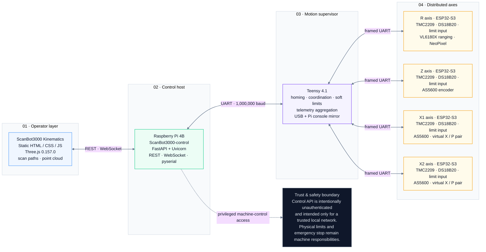

# ScanBot3000 Architecture

## Repository boundaries

ScanBot3000 uses separate repositories because the three implementation layers have different runtimes, deployment environments, dependencies, and contribution surfaces.

### `ScanBot3000-kinematics`

Static Three.js browser client for 3D kinematics, scan-path UI, control widgets, and range-point visualization. It can operate in visualization-only mode without hardware.

### `ScanBot3000-control`

FastAPI application for the Raspberry Pi. It owns HTTP/WebSocket transport, dashboard serving, UART reconnect behavior, bounded telemetry buffers, runtime settings, and helpers that translate web operations to Teensy console commands.

### `ScanBot3000-firmware`

Embedded PlatformIO project for the Teensy 4.1 supervisor and ESP32-S3 axis nodes. It owns homing, coordinated motion, telemetry, driver control, sensors, local displays/LEDs, and serial protocols.

## Data flow

1. The operator opens the static kinematics client or the built-in control dashboard.
2. Browser requests reach `ScanBot3000-control` over REST/WebSocket on the trusted LAN.
3. The control service bridges requests and console telemetry over the Raspberry Pi primary UART (`/dev/serial0` in the recorded deployment) at 1,000,000 baud.
4. The Teensy 4.1 supervises motion and exchanges framed serial data with ESP32-S3 axis controllers.
5. R/Z/X1/X2 telemetry returns through the same path to the browser.

## Motion model

The firmware exposes physical axes `R`, `Z`, `X1`, and `X2`. The Teensy also derives virtual coordinated `X` and `P` coordinates from the X1/X2 pair. X/Z/P coordinated absolute targets require homing and are constrained by firmware soft limits; R is separately controlled.

## Trust boundaries

The current FastAPI service is unauthenticated. CORS is restricted to common local origins in code, but CORS is not authorization. Network access to the control API is therefore privileged machine-control access.

Mechanical safety, supply protection, independent emergency-stop design, and safe physical clearances are machine-level responsibilities outside these repositories.
